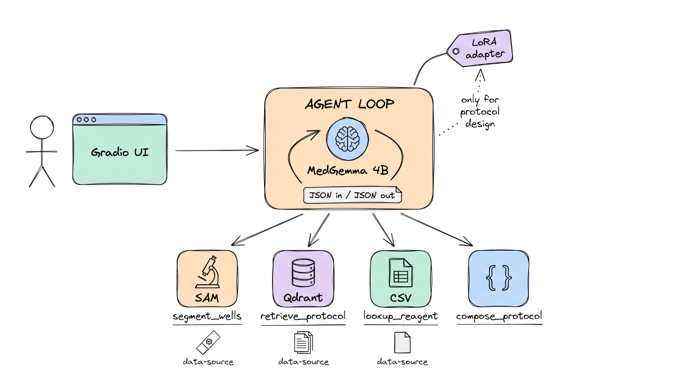

# biolab-agent-base

Starter environment for an **autonomous laboratory agent**. Given a
natural-language request, the agent segments microplate images, retrieves
SOPs from a local protocol corpus, looks up reagents, and produces a
structured protocol, optionally polished with a LoRA-fine-tuned model.

The repository ships the Docker stack, datasets, fine-tuning data, an
evaluation harness, and an abstract `BaseAgent` contract. A working
`BaselineAgent` is included as a reference implementation. It scores
**11/15 / 0.71** on the public benchmark; failure modes are left in
place as room for someone to improve on.




---

## How it works

Every query passes through the same loop:

1. **User input.** A natural-language request, optionally with a list of
   image IDs from `data/images/`. Submitted via `POST /ask`,
   `biolab-bench`, or the Gradio UI.
2. **Agent loop.** `BaselineAgent` (in `src/biolab_agent/agent/baseline.py`)
   runs up to 10 turns. Each turn it sends the full conversation to
   **MedGemma-4B** (Ollama) and forces a single JSON object as the reply:
   either a tool call (`{"tool": ..., "arguments": ...}`) or a final
   answer (`{"final": ..., "structured": ..., "citations": [...]}`).
3. **Tool dispatch.** The loop parses the JSON, runs the tool, and feeds
   the result back to the LLM as a `role: "tool"` message. Tools
   available to the agent:
   - `segment_wells(image_id, prompt)` runs SAM mask-generation and
     returns per-cell masks, count, and confluency.
   - `retrieve_protocol(query, k)` embeds with BGE and queries Qdrant
     over 200 OpenTrons protocols; returns top-k chunks with `doc_id`
     and `chunk_id`.
   - `lookup_reagent(name)` does a CSV substring search against
     `data/reagents/catalog.csv`.
   - `compose_protocol(...)` Pydantic-validates a structured protocol
     definition.
4. **Auto-aggregation.** Python collects trustworthy outputs (per-well
   counts, retrieved doc IDs) into the final result so the LLM cannot
   silently hallucinate over them.
5. **Adapter polish (protocol-design only).** If the query mentions
   "design / draft / compose / structured protocol", the agent unloads
   Ollama's MedGemma, loads the fine-tuned LoRA adapter via Hugging Face
   transformers, runs one inference pass to refine the structured
   protocol, then frees the GPU.
6. **`AgentResult`.** Natural-language answer plus structured payload,
   tool trace, and citations. Consumed by the FastAPI service, the
   harness, or the Gradio UI.

To plug in a different agent, set `BIOLAB_AGENT_CLASS` to your
`BaseAgent` subclass. The tools, data, and harness stay identical; the
score that comes out the other side is the comparison.

### What "agentic" means here

The LLM picks each next step based on what the previous tool returned.
No Python `if/else` choreographs the flow. For example, the composite
task *"row D, if max count > 100 retrieve a PCR protocol"* runs as:

```
LLM → segment_wells D01 → 17 cells     → continue
LLM → segment_wells D02 → 18 cells     → continue
LLM → segment_wells D03 → 59 cells     → continue
LLM → segment_wells D04 → 18 cells     → continue
LLM → segment_wells D05 → 148 cells    → max > 100 → retrieve_protocol
LLM → retrieve_protocol("PCR prep")    → 925d07-v3
LLM → final answer + citation
```

If max had been < 100, the LLM would skip retrieval and recommend
continuing culture. Branching, batching, and refusal behaviour all live
inside the LLM's choice of next tool, not in the harness or the tool
implementations.

---

## Repository contents

| Path | Contents |
|---|---|
| `Dockerfile`, `docker-compose.yml` | Multi-stage CUDA-ready image with Ollama + Qdrant sidecars |
| `pyproject.toml` | Pinned dependency stack (uv / pip) |
| `src/biolab_agent/` | `BaseAgent` interface, FastAPI server, typed schemas, `BaselineAgent` reference implementation |
| `eval/harness.py`, `eval/metrics.py` | 15-task benchmark runner + scoring functions |
| `data/images/` | 20 cell-microscopy images from [BBBC002 v1](https://bbbc.broadinstitute.org/BBBC002) with published cell counts |
| `data/protocols/opentrons.jsonl` | 200 OT-2 protocols harvested from [Opentrons/Protocols](https://github.com/Opentrons/Protocols) |
| `data/reagents/catalog.csv` | Reagent + labware entries extracted from the protocols |
| `data/finetune/` | 500 train / 50 eval instruction pairs derived from the protocols (for Unsloth LoRA) |
| `data/queries_public.yaml` | 15 benchmark tasks |
| `scripts/` | Bash + PowerShell scripts for setup, data fetch, model pull, benchmark |
| `ui/app.py` | Gradio web UI showing the agent's answer + tool trace + segmentation overlays |

---

## Prerequisites

- **Docker 26+** with Compose v2 (Docker Desktop on Mac / Windows works fine).
- **NVIDIA Container Toolkit** (Linux) or WSL2 + NVIDIA CUDA (Windows) for GPU.
  CPU-only works via `docker-compose.cpu.yml`, see "Mac / no-GPU" below.
- **Python 3.11+** on the host (only needed for the data-build step).
- **Git Bash** (Windows) or native bash (macOS / Linux) for the shell scripts.
  PowerShell equivalents exist for the two most-used scripts.

The stack defaults to:

- **LLM**: MedGemma 4B via Ollama (`medgemma:4b`)
- **Embeddings**: `nomic-embed-text` (override in `.env`)
- **Vector DB**: Qdrant
- **ML stack**: PyTorch 2.4 / CUDA 12.4
- **Fine-tuning**: Unsloth (`pip install '.[finetune]'`)
- **Segmentation**: `facebook/sam-vit-base` (replaceable; see below)

---

## Quick start

The repository ships pre-fetched data (BBBC images, OpenTrons protocols,
reagent catalog) and the LoRA adapter via Git LFS, so a fresh clone is
ready to run after building the stack.

### 1. Clone and pull the LFS adapter

```bash
git clone https://github.com/prakash-aryan/biolab-agent-base.git
cd biolab-agent-base
git lfs pull            # fetches artifacts/lora-protocol-text/*.safetensors
cp .env.example .env
```

If you forgot `git lfs install` before cloning, run it now and then
`git lfs pull`.

### 2. Build the image

```bash
docker compose build
```

This is the slow step (~15 min on a fresh machine). It produces the
`biolab-agent-base` image with PyTorch, transformers, peft,
bitsandbytes, qdrant-client, sentence-transformers and the project
package itself.

### 3. Start the stack

GPU host:

```bash
docker compose up -d
```

CPU-only host:

```bash
docker compose -f docker-compose.yml -f docker-compose.cpu.yml up -d
```

Host already running an Ollama on port 11434:

```bash
docker compose -f docker-compose.yml -f docker-compose.host-ollama.yml up -d --no-deps qdrant app
```

### 4. Pull the LLM + embedding models

```bash
docker compose exec ollama ollama pull medgemma:4b
docker compose exec ollama ollama pull nomic-embed-text
```

If you used the host-Ollama override, run those `ollama pull` commands
on the host instead of through `docker compose exec`.

### 5. Index the protocol corpus into Qdrant

```bash
docker compose exec app biolab-index
```

### 6. Run the benchmark

```bash
docker compose exec app biolab-bench
```

When the stack is up you can also open:

- http://localhost:8000/healthz (FastAPI liveness)
- http://localhost:8000/readyz (readiness for Ollama + Qdrant)
- http://localhost:6333/dashboard (Qdrant dashboard)
- http://localhost:11434/api/tags (Ollama model list)
- http://localhost:7860 (Gradio UI; start with `docker compose exec app python ui/app.py`)

### Optional: one-shot scripts

Steps 2-5 are also wrapped by helper scripts for people who don't want
to type. They're equivalent to running the commands above.

```bash
bash scripts/setup.sh                            # Linux / macOS / WSL2 / Git Bash
powershell -ExecutionPolicy Bypass -File .\scripts\setup.ps1   # Windows
```

---

## Hardware notes

No hard GPU requirement. Ollama serves MedGemma on CPU (Q4 quantized 4B
needs ~3 GB RAM). Segmentation and Unsloth training are slow on CPU;
Google Colab's free T4 is a workable fallback for the LoRA training
run. Use the `docker-compose.cpu.yml` override (see step 3 above) to
skip the NVIDIA runtime entirely.

On a workstation with >=12 GB VRAM, set
`BIOLAB_HF_MODEL=unsloth/medgemma-4b-it` to skip the bnb-4bit
quantization path during the adapter polish step.

---

## Writing your own agent

Create a new module (e.g. `src/biolab_agent/agent/solution.py`) and
subclass `BaseAgent`:

```python
from biolab_agent.agent.base import BaseAgent, AgentConfig
from biolab_agent.schemas import AgentResult

class MyAgent(BaseAgent):
    def run(self, query: str, image_ids: list[str] | None = None) -> AgentResult:
        ...
```

Point the harness and server at your class:

```bash
export BIOLAB_AGENT_CLASS=biolab_agent.agent.solution:MyAgent
docker compose restart app
```

The FastAPI service auto-loads the class on startup; `/ask`, the CLI
(`biolab-bench`), and the evaluation harness all read the same env var.

### Tools to implement

- `segment_wells(image_id, prompt)`: segmentation backend producing `WellMasks` (cell count + confluency)
- `retrieve_protocol(query, k)`: RAG over `data/protocols/` via Qdrant
- `lookup_reagent(name)`: CSV lookup against `data/reagents/catalog.csv`
- `compose_protocol(steps)`: validate and emit a structured protocol JSON

The starter ships a working `BaselineAgent`
(`src/biolab_agent/agent/baseline.py`) using prompt-driven JSON
tool-calling, plus reference implementations of all four tools.

---

## Reference baseline

`BaselineAgent` running on:

- Ollama MedGemma-4B for tool-calling
- `facebook/sam-vit-base` mask-generation for segmentation
- Qdrant + BGE for retrieval
- LoRA adapter at `artifacts/lora-protocol-text/` polishing protocol-design tasks

scores **11/15 passes, 0.71 overall** on the public benchmark. Failure
modes left as headroom: T7 (PCR retrieval ranking), T10 (refusal
phrasing), T12 (exact-name quoting), T15 (tool-order discipline). To
swap in a stronger segmenter, replace
`src/biolab_agent/segmentation/sam_backend.py` with an EfficientSAM3
wrapper using weights from `Simon7108528/EfficientSAM3`.

### LoRA adapter (Git LFS)

The fine-tuned adapter is checked into the repo via **Git LFS** at
`artifacts/lora-protocol-text/`. To pull the actual weights you need
git-lfs installed before cloning (or run `git lfs pull` after).

```bash
# Ubuntu / Debian
sudo apt-get install git-lfs
git lfs install
# macOS
brew install git-lfs && git lfs install

# Then either:
git clone https://github.com/prakash-aryan/biolab-agent-base.git
# or, if you already cloned:
git lfs pull
```

The agent picks the adapter up automatically through the default
`BIOLAB_LORA_ADAPTER` env var in `.env.example`. To train your own:

```bash
pip install -e '.[finetune]'
python -m biolab_agent.finetune.train          # ~20 min on an 8 GB GPU
# Adapter lands at artifacts/lora-protocol/. Move/symlink to
# artifacts/lora-protocol-text/ and the agent will use it.
```

---

## Running the benchmark

```bash
# All 15 tasks against whatever BIOLAB_AGENT_CLASS is set.
docker compose exec app biolab-bench

# Or against a specific agent:
docker compose exec app biolab-bench --agent-class biolab_agent.agent.solution:MyAgent
```

The report is written to `artifacts/bench_report.json` and summarized to
stdout. Each task is scored against BBBC002 cell counts, registered
protocol `doc_id`s, or reagent catalog entries (see `eval/metrics.py`).

---

## Conventions

- Python 3.11, strict typing encouraged.
- Formatting and linting via `ruff` (`pyproject.toml` configures it).
- Tests via `pytest`; use the `@pytest.mark.gpu / ollama / qdrant / slow`
  marks to gate expensive tests.
- LF line endings enforced in `.gitattributes`, matters for Git Bash on Windows.

---

## License

Starter code: Apache-2.0. Bundled data sources keep their own licenses:

- **BBBC002** images: public domain (Broad Institute CC0)
- **Opentrons/Protocols**: Apache-2.0

See [`data/DATA_SOURCES.md`](./data/DATA_SOURCES.md) for attribution details.
